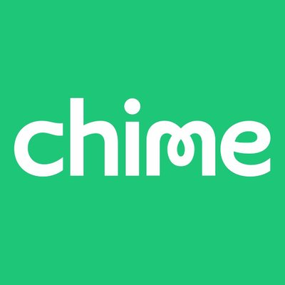

# Chime

    

    

## Origin and Overview

Chime was founded in 2013 by Chris Britt and Ryan King. The company’s mobile application was released in 2014, yet it was incorporated in 2013. The founders had slightly different backgrounds. Chris was in strategy consulting before moving to Silicon Valley during the 2000’s where he had experience as product officers in multiple start-ups which led to him to work at Visa and GreenDot, Chime’s biggest service collaborators. Ryan is more of the technical , in terms of technology skill and use, as per Chris in this [podcast](‎https://podcasts.apple.com/mn/podcast/chris-britt-ceo-and-co-founder-of-chime/id1042827113?i=1000446670423). The company was born when the founders realized that after the financial crisis of 2008 (The Great Recession of 2007), millennials were struggling with basic banking fees. The company is currently funded by private investors.  Chime is not a Bank Holding Company, BHC, they are an online company that offers banking products by partnering with BHCs like Bancorp and Stride Bank which are their FDIC counter parts. They have raised 1.5B in seven years. The company is currently valued at 14.5B USD. 

## Business Activities

Chime was created to ease the burden of banking on millennials by profiting “with” them instead of “from” them [Chime’s about us](https://www.chime.com/about-us/).  Since 2013 (Chime’s founding) the average fees for interest bearing accounts was 15.50 USD, the average minimum deposit needed for checking accounts was 970.93USD and insufficient funds fees averaged 33.47 USD as per a survey from [Bankrate.com](https://www.bankrate.com/banking/checking/checking-account-survey/). Since Chime’s founding this means that the average fee for interest bearing accounts rose by 5.87% and 29.49% since The Great Recession. The average minimum deposit also rose because of the regulatory changes since the recession by 45.23%. Finally, out of network ATM fees and insufficient fees rose by 12.35% and 3.94% respectively. All included that is an increase of 22.17% in fee cost and 45.23% increase on the average deposit minimum. Chime’s answer was no fees. 

Their value proposition is to give consumers more control over their finances at zero fees, with added bonuses, such as: receiving paychecks 2 days early, not charging overdraft fees (up to a limit) and helping members build credit with their acquisition of Pinch. The way Chime makes money is by the Visa Pre-Paid cards the come with their spending account (checking account). For each transaction they profit a percentage so instead of fees for having an account whenever they purchase anything online or with their card, they get a transaction fee. Their other way of earning revenue is by their savings account. This is more like traditional banking where the customer will be paid interest on their balance in their respective savings account and the bank invests it in higher yielding products. Chime, in this case, lets the partner banks invest the savings in higher yield products. What makes Chime interesting is that they have an automatic saving feature. if enabled, where you can put money in your savings account directly from your direct-deposit or when you spend. 

Their intended demographic are millennials earning 35,000 to 70,000USD. Currently they have more than 8 million accounts out of a possible 81 million millennials living in the United States based on the research done by [the college investor](https://thecollegeinvestor.com/14611/average-net-worth-millennials/).  Their research is based on a survey by the National Association of Colleges and Employers which show that the starting salary from the company’s founding till 2019 was 45,237 to 50,004 USD. This fits perfectly in the company’s range and does not include the non-college educated persons. As of early 2020 Chime reported that they have approximately 8 million accounts which is less than 10% of their demographics. They have room for growth with new generations joining the workforce and being more technology dependent. 

Chime’s advantages have dwindled since they have been in the market for about 7 years. Chime’s advantages are that it charges no fees, some of its competitors have a subscription model to different tiers of their banking products, have a higher threshold in their overdraft free protection, and are not strictly regulated like traditional banks. Their greatest draw is their simple, user friendly mobile application, and their ability draw in new customers. 

As a FinTech company, Chime uses several technologies based from [Stackshare](https://stackshare.io/chime/chime), which will be broken down to three segments: its mobile app, data, and artificial intelligence. Chime uses the following applications for its mobile app: React, React Native, e56, TypeScript, Rails, & Go. For data and data storage they use Amazon EC2 (cloud server), Amazon S3 (store and retrieve data), Amazon RDS (relational database in the cloud), Amazon Aurora, Snowflake (data warehouse), and AWD Glue. Lastly, Chime uses AI for predictive personalization to drive new account signups [from thefinancialbrand.com](https://thefinancialbrand.com/73355/predictive-analytics-digital-banking-website-accounts/). Chime uses, based on my inference, the application for their mobile app to make it user friendly and effective. In order for the company to be a Neobank and hold all its banking operations at a low cost they partner with Amazon’s cloud technology to operate data warehouses and manage information of its customers so they can analyze it using A.I. Finally, A.I. is used in the strongest advantage in Chime’s business marketing. Chime has used A, I, to use predictive personalization to increase new account signups. They used the A.I. to customize and personalize their website to increase their odds to gain new customers.  

## Landscape

Chime is classified as a Neobank. [Neobanks](https://www.thebalance.com/what-is-a-neobank-and-should-you-try-one-4186468#:~:text=right%20for%20you.-,What%20Is%20a%20Neobank%3F,management%20through%20a%20mobile%20app.) are financial technology firms that offer internet-only financial services and lack physical branches. Even though Chime doesn’t have a physical branch, it can receive cash deposits through its partnership with GreenDot, making it a viable alternative for consumers looking for a less expensive way to bank.

Big Data and AI are revolutionizing the way banks do business. In the past, risk analysis was based solely on credit. However, through the use of the aforementioned technologies, modern risk assessments now include spending history and online activity and all this data can now be combed by A.I. effectively to target customers efficiently. 

Thus far, Neobanks have used their edge in technology to target underserved populations using AI and Big data analeptics to reach consumers and businesses online. Big Data is also being used to assess small businesses and small business loans, albeit Chime does not offer this yet, which is a very underserved market in traditional banks that lack Big Data analysis. 

The major companies in this field challenging Chime are: Varo, Simple, Revolut, N26, and NuBank. The first two are direct challengers in USA. the latter three, while having different business models, are bigger and international, which may help them become direct competitors in the future. 

## Results

Chime’s business impact has been nothing short of astounding. Since mid-2018 they’ve managed to increase their new accounts by 700%, raised their valuation by 2,800% (to 14.5B) and processed 30B USD in transactions in 2019. Their main revenue service is a percentage per amount spent in a transaction.  In 2020, Chime’s CEO Chris Brett stated that they had also increased their transaction volume 3x compared to 2019, an incredible feat considering the pandemic.

Success, in this field, is measured can be measured by: number of accounts opened, revenue and private financial valuation. Since Chime is in the startup phase EBITDA is overlooked at this point in its development phase. Using the previously mentioned metrics, Chime is doing quite well, as they were able to: open 3 million accounts (60% increase from 2018 to 2019) and quadruple its revenue in 2019 to 200 million. In terms of future success, Chime’s latest series F financing has valued Chime at 14.5 Billion USD, thereby surpassing all other neo banks in the USA. In 2020, based on Chriss Britt’s comments after Chime’s new series funding, their transactions are on pace to increasing 3x, which means that they will be collecting 1-2% based on 90 billion USD worth of transactions. If in 2019 they had 30 billion in transactions and approximately 200 million in revenue, in 2020 we should be expecting approximately 600 million in revenues. 

This estimate is based on a simple mathematical equation where: revenue/ dollar amount of tractions= revenue per dollar amount of transaction. Then, revenue per dollar of transaction x estimated dollar amount of transaction = estimated revenue. That being said, its latest valuation makes my revenue estimate edge towards the lower end of the spectrum. It has been [stated](https://www.cnn.com/2020/10/05/business/chime-bank-startup/index.html) that the 14.5 Billion USD is at a 20x Revenue which means that their revenue is at a range from 600 million to 725 million in Q3 2020.  In 2020, while the exact number was not disclosed, Chime’s EBITDA was positive, which normally is not the case for start-ups at this point of their growth stage.

In order to assess how Chime fares against other competitors in its industry, the following metrics will be used: number of accounts opened, revenue and future success business valuation. The companies evaluated will be: Simple Bank, Varo, Revolut, N26 and Nubank.

Simple Bank was acquired by BBVA for 117 million in 2017. Chime was valued at 1.5B in 2018. In their good will write down, BBVA [stated](https://www.fintechfutures.com/2017/02/bbva-writes-down-89-5m-for-simple-in-three-years-since-117m-acquisition/) that Simple Banks active account users were 33k in 2014. BBVA was acquired by PNC in 2020 and its 10k does not separate Simple Banks operations instead it is coupled with their “Other” section making it hard to dissect its performance. 

Varo, as of early [2020]( https://techcrunch.com/2020/06/03/challenger-bank-varo-soon-to-become-a-real-bank-raises-241m-series-d/), has 2 million accounts and recently received 241 million USD in Series D funding (total funding received 419M). While Varo’s revenue no private financial valuation could not be verified, the grandeur of private businesses, based on the 2 million accounts opened we can safely assume at its current state Chime is ahead.

Revolut is a challenger bank based in London. Its revenue in 2019 was 162.7m EUR which using the F/X [spot rate](https://www.exchange-rates.org/Rate/EUR/USD/12-31-2019) 1.1213 means it generated approximately 182.5M USD which loses out to Chime’s 200M.  Its total users, which doesn’t accurately depict accounts, is 12 million as of 2020. Revolut’s current business valuation is 5.5 billion. Chime is ahead of Revolut in revenue and business valuation. While there is no direct correlation with total accounts and total users it is safe to assume Revolut’s 12 million users as of June 2020, is ahead of Chime’s 8 million accounts. 

N26, a German ran Fintech challenger bank, had 5 million customers by the end of 2019. It is valued at 3.5 billion, and its last reported revenue was 43 million Euro in 2018. Chime is ahead of N26 in terms of revenue and business valuation. While accounts open and total customers are not directly mentioned, Chime may be ahead of N26 in regard to revenue, which could mean that either each user Chime has is more profitable or Chime has more users.

NuBank, a Brazilian challenger bank, was at 3.6B in 2020. Their current valuation was at 10 billion as of 2019. Its total funding amount is 1.4 Billion, just 100 million short of Chime, but it has more revenue outlets, operates in more countries, and has 26 million customers. Based on NuBanks performance, it is the strongest competitor. 

In conclusion, Chime has a strong foothold against most of its competitors due to its growing account total, higher revenues, and lofty business valuation. The only competitor that is ahead of Chime in most of the metrics is NuBank. However, Chime can continue growing compared to the limited product suite it currently has.

## Recommendations

The main weakness Chime has is its limited product suite and revenue generators. My recommendation would start by increasing their current product suites in the personal finance /online banking categories and then moving on to small businesses. Currently, they mainly focus on their checking & savings account and their revenues come from the transactions used in their prepaid Visa debit cards and their savings account. Chime has so many areas to continue provide more value-added services.

They can leverage current technologies to grow their service portfolio into offering loans via credit cards. They can use AI to conduct a risk assessment of their customers using their spending habits to see the probability on what they would spend their credit on and monitor their cash flow to see their ability to pay. They can pair this new service with their credit building technology to help customers improve their credit score, while staying true to their no fee mission statement.

Also, they can integrate new technology and go the Robinhood/Bettermint route in the future. They can introduce a new investing service with robo-advisors to continue a nonphysical branch with tailored advisors based on customer parameters. They can introduce this investing feature the way they have their savings account set up. Customers can allocate a percentage of their direct deposits and/or a percentage of what they spend into their investment account. Chime could earn revenue per investment decision, every buy or sell order. By using rabo-advisors they will gain the advantage that they will not need a physical presence and also by adding machine learning operating systems to these rabo-advisors it will be effecient decision making and tailored to the customer's goals. These changes will increase revenue, add customers, and bundle more of a product suite that handles spending, saving, and investing.

Other ideas for Chime would be to partner with more payment technology companies. For example, they can partner up with Paypal, Apple Pay, and Venmo. Currently because Chime uses prepaid Visa cards it is not accepted on those other platforms. To send money to other users both users must have Chime. By partnering up with these other FinTech services/companies it will increase Chime’s versatility for its customers, add more users, and increase their revenue with customers that use Apple Pay technology increasing the number of transactions they can obtain.

 The technologies they would need to add would be machine learning and robo-advisors. The technology is appropriate because to assess risk going forward, after data is collected an, A.I. would apply machine learning to analyze past, present, and future trends in their credit cards and investing business lines. Robo-advisors would also be partnered with machine learning and big data analytics to optimize investing profiles and portfolios for the customer. 

 These new products will increase Chime’s user base and revenue, maintain its current business mission statement which no fee core banking services, and adds more daily value to consumer’s banking needs. It would also give Chime a stronger connection to growing financially with its customers.
### References
1.	https://podcasts.apple.com/mn/podcast/chris-britt-ceo-and-co-founder-of-chime/id1042827113?i=1000446670423
2. https://www.investopedia.com/how-chime-makes-money-4796705
3. https://www.fintechtris.com/blog/chime-bank-top-neobank-in-us
4. https://productmint.com/the-chime-business-model-how-does-chime-make-money/
5. https://www.crunchbase.com/organization/chime-2/company_financials
6. https://www.businessinsider.com/chime-valuation-skyrocketed-after-last-week-funding-round-2020-9#:~:text=Chime%27s%20valuation%20skyrocketed%20to%20%2414.5%20billion%20last%20week&text=US%2Dbased%20Chime%20was%20valued%20at%20%2414.5%20billion%20last%20week.
7. https://www.bankrate.com/banking/checking/checking-account-survey/
8. https://www.chime.com/about-us/
9. https://www.latimes.com/business/story/2020-02-20/chime-digital-bank#:~:text=by%20the%20millions.,1%20million%20people%20signed%20up.
10. https://thecollegeinvestor.com/14611/average-net-worth-millennials/
11. https://www.thesimpledollar.com/banking/best-online-banks/
12. https://www.thepennyhoarder.com/bank-accounts/varo-vs-chime/#:~:text=Savings%20Account%20Interest%20Rates&text=Chime%20Savings%20offers%20a%201.00,least%20%241%2C000%20in%20a%20month.
13. http://lumosbusiness.com/business-model-canvas-n26/#:~:text=Value%20Proposition&text=No%20Fee%2FLow%20Fee%20Banking,Tools%20to%20streamline%20accounting%2C%20etc. 
14. https://stackshare.io/chime/chime 
15. https://thefinancialbrand.com/73355/predictive-analytics-digital-banking-website-accounts/
16. https://www.finsmes.com/2020/03/what-are-neo-banks-and-how-will-they-shape-the-future-of-finance.html
17. https://medium.com/fintechtris/fintech-focus-neobanks-taking-over-why-2020-is-the-time-to-switch-77ab1ab0f212
18. https://www.cnbc.com/2020/09/18/chime-is-now-worth-14point5-billion-surging-past-robinhood-as-the-most-valuable-us-consumer-fintech-.html
19. https://www.cnn.com/2020/10/05/business/chime-bank-startup/index.html 
20. https://techcrunch.com/2018/05/31/no-fees-mobile-banking-service-chime-raises-70m-series-c-valuing-its-business-at-500m/
21. https://www.pymnts.com/news/digital-banking/2020/challenger-bank-chime-more-valuable-than-robinhood/
22. https://www.forbes.com/sites/jeffkauflin/2019/11/18/digital-bank-chime-will-quadruple-its-revenue-in-2019-reeling-in-direct-deposits/?sh=5d35adba6487
23. https://www.crowdfundinsider.com/2020/09/167007-us-banking-challenger-chime-to-focus-on-transaction-processing-based-business-model-after-reaching-14-5-billion-valuation-with-additional-funding/
24. https://www.businessinsider.com/chime-set-to-quadruple-revenue-in-2019-2019-11#:~:text=US%20neobank%20Chime%20is%20set,the%20matter%20cited%20by%20Forbes.
25. https://finovate.com/the_importance_of_the_bbva_simple_deal/
26. https://www.bbva.com/en/bbva-acquires-simple-to-accelerate-digital-banking-expansion/
27. https://www.fintechfutures.com/2017/02/bbva-writes-down-89-5m-for-simple-in-three-years-since-117m-acquisition/
28. https://techcrunch.com/2020/06/03/challenger-bank-varo-soon-to-become-a-real-bank-raises-241m-series-d/
29. https://www.fintechtris.com/blog/deep-dive-on-varo-fintechs-first-bank
30. https://www.exchange-rates.org/Rate/EUR/USD/12-31-2019
31. https://www.businessofapps.com/data/revolut-statistics/
32. https://www.cnbc.com/2020/08/11/revolut-2019-results-losses-revenues-triple-in-2019.html
33. https://techcrunch.com/2020/01/27/n26-reaches-5-million-customers-including-250000-in-the-us/
34. https://www.world-today-news.com/n26-reports-sales-of-43-million-euros-and-a-doubling-of-the-loss/
35. https://techcrunch.com/2020/05/05/n26-raises-another-100-million-in-series-d-extension/#:~:text=In%20total%2C%20N26%20has%20raised,at%20a%20%243.5%20billion%20valuation.
36. https://latamlist.com/nubank-almost-doubles-revenue-in-h1-2020/#:~:text=LatamList%20%E2%80%93%20Nubank%2C%20the%20Brazilian%20neobank,48%25%20increase%20from%20December%202019.&text=Read%20more%20on%20the%20Nubank%20Blog.
37. https://techcrunch.com/2020/03/03/valued-at-10b-nubank-launches-its-nu-credit-card-in-mexico/
38. https://www.cnn.com/2020/10/05/business/chime-bank-startup/index.html 
